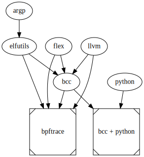

# Building bpftrace and bcc for Android
This branch contains set of makefiles preparing custom sysroot for Android containing bpftrace, bcc and few other tools which you can just copy over to your phone.

## Requirements
Makefiles in this branch make use of the following tools on the build machine:
- ndk supporting API level 28 and containing gcc (r17c)
- make
- cmake
- autoconf
- automake
- libtool
- help2man
- git
- wget
- sed
- gnu tar
- bison

## Usage
The following builds and copies a sysroot directory containing bpftrace, bcc, python and their dependencies to your android device under `/data/local/tmp/bpftools-0.0.1`:

```bash
make THREADS=8 NDK_PATH=<path to android-ndk-r17>
make install
```

In order to use bpftrace you need to tell your adb shell session where to find all the executables and libs. You can set `PATH` and `LD_LIBRARY_PATH` on your own or just source `setup.sh` script.

Inside `adb shell` run:
```bash
. /data/local/tmp/bpftools-0.0.1/setup.sh
```

The script takes care of creating some additional symlinks that will make bcc's python frontend happy.

If you intend to peek at kernel data structures you'll need to make kernel headers available to bpftrace. Copy them to the device and export two more shell variables:
```bash
export ARCH=arm64
export BPFTRACE_KERNEL_SOURCE=<path to kernel headers>
```

## Included projects
Makefiles included in this branch fetch sources of and cross compile following projects:
- [bpftrace](https://github.com/iovisor/bpftrace)
- [bcc](https://github.com/iovisor/bcc)
- [python](https://github.com/python/cpython)
- [llvm + clang](https://github.com/llvm/llvm-project)
- [flex](https://github.com/westes/flex)
- [elfutils](https://sourceware.org/elfutils/)
- [argp (part of gnulib)](https://www.gnu.org/software/gnulib/)

Here is the topology:



## Android ndk requirement
You need Android ndk new enough to target API level 28 but old enough to still contain gcc (in newer ndks gcc was dropped and all binaries looking like gcc are fancy named clang). We need gcc because elfutils demands that provided c compiler understands nested functions (and clang does not). Ndk r17c is ok.

## Building bcc
Master of bcc requires uapi headers which are not available in the ndk. As a short term-workaround we pull in a fork based on a revision that does not require new headers: https://github.com/michalgr/bcc/tree/compile-for-android 